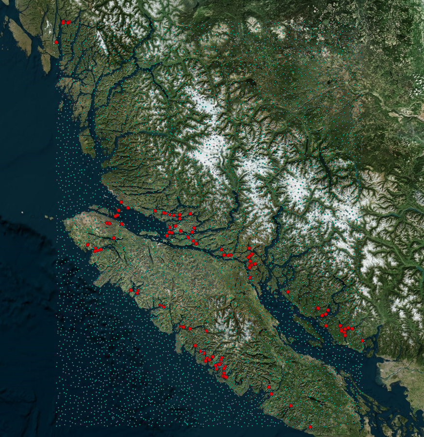

# SalmonDetection

------------------

## How to use

1. Download images with nets present with [2019-11-16-pp-Download_net_images_and_around_nets.ipynb](2019-11-16-pp-Download_net_images_and_around_nets.ipynb).
2. Download random images (most of them will be without net) with [2019-11-16-pp-Download_random_images.ipynb](2019-11-16-pp-Download_random_images.ipynb).
3. Resize images and train a ResNet18 Classification model with [2019-11-16-pp-Modeling.ipynb](2019-11-16-pp-Modeling.ipynb).
4. Predict the net probability for the random images and manually select the ones with nets present by looking at those with highest probability with [2019-11-17-pp-Predict.ipynb](2019-11-17-pp-Predict.ipynb).
5. Use the remaining random images that you did not select as having nets present as training examples for "no net present".
6. Repeat steps 3-5 until you have covered the search space.
